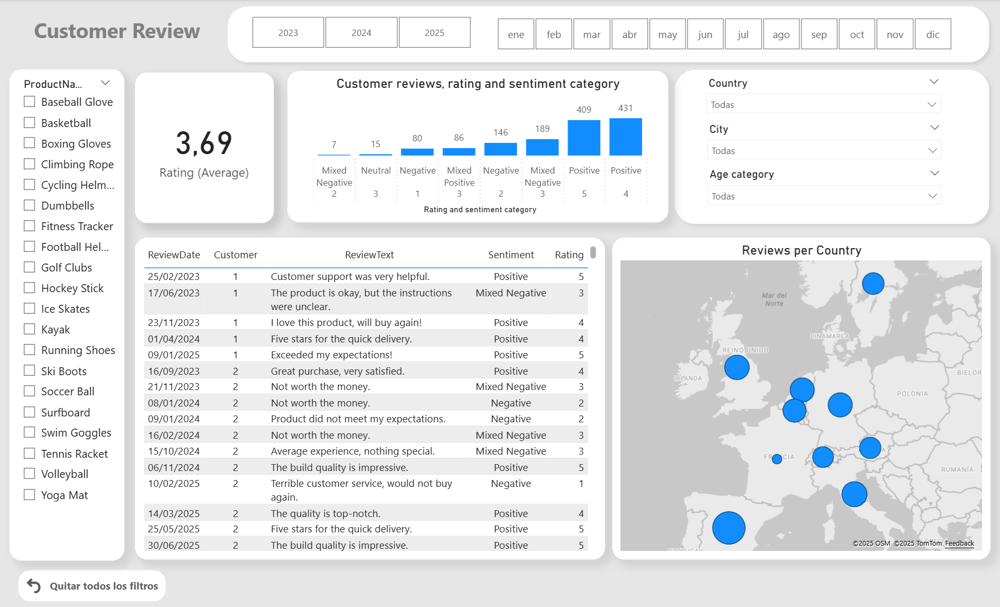

# Marketing Analytics Project  
**Sentiment Intelligence + Power BI Dashboard**

---

##  Report Cover




---

##  Project Overview

This repository contains an **end-to-end data analytics project applied to marketing**. The workflow integrates:

- **SQL** for extracting, cleaning, and managing relational data (users, ratings, comments).  
- **Python** (using libraries such as `pandas`, `NLTK` or `TextBlob`) for performing sentiment analysis on customer reviews.  
- A **custom metric** that combines numeric ratings with text-based sentiment to classify user experience (Positive, Neutral, Negative).  
- **Power BI** for building an interactive and visually appealing dashboard to explore sentiment trends and business insights.  

---

##  Repository Structure

├── data/
│ ├── raw/ # Raw data exported from the relational database
│ └── processed/ # Processed/clean datasets ready for analysis and visualization
├── sql/
│ └── queries.sql # SQL scripts for data extraction and preparation
├── notebooks/
│ └── Customer_reviews_enrichment.ipynb # Python notebook for sentiment analysis
├── powerbi/
│ └── Final dashboard.pbix # Power BI file with the final dashboard
├── assets/
│ └── Front.png # Power BI report cover image
├── README.md
└── requirements.txt # Python dependencies


---

##  How to Use

### 1. **Data Extraction**
- Connect to the Bak file containing relational databases.  
- Run the scripts to extract raw and queried datasets.  

### 2. **Data Transformation**
- Open and run the ipynb notebook according to your SQL and laptop credentials 
- Steps include:
  - Data cleaning & preprocessing.  
  - Sentiment analysis using natural language processing.  
  - Creating a **hybrid metric** combining `rating_score` and `sentiment_score`.   

### 3. **Sentiment Analysis in Python**
- Libraries such as `NLTK`, `TextBlob`, `VADER`, or `spaCy` can be used.  
- Export a dataset containing the final **sentiment_category** (Positive / Neutral / Negative).  

### 4. **Visualization in Power BI**
- Open Final dashboard.pbix 
- Load processed data.
- Check existing visuals and change them with new ideas such as:  
  - Sentiment distribution (bar/pie charts).  
  - Time-series trends of customer sentiment.  
  - Filters by product, date, or region.  
- Customize the design for clarity and storytelling.  

---

##  Dependencies (requirements.txt)

```txt
pandas
numpy
nltk
textblob
sqlalchemy     # if connecting to SQL from Python

---


## **Use**

pip install -r requirements.txt


